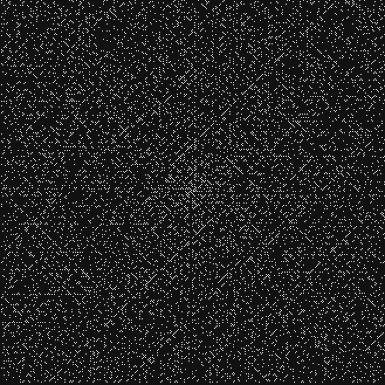
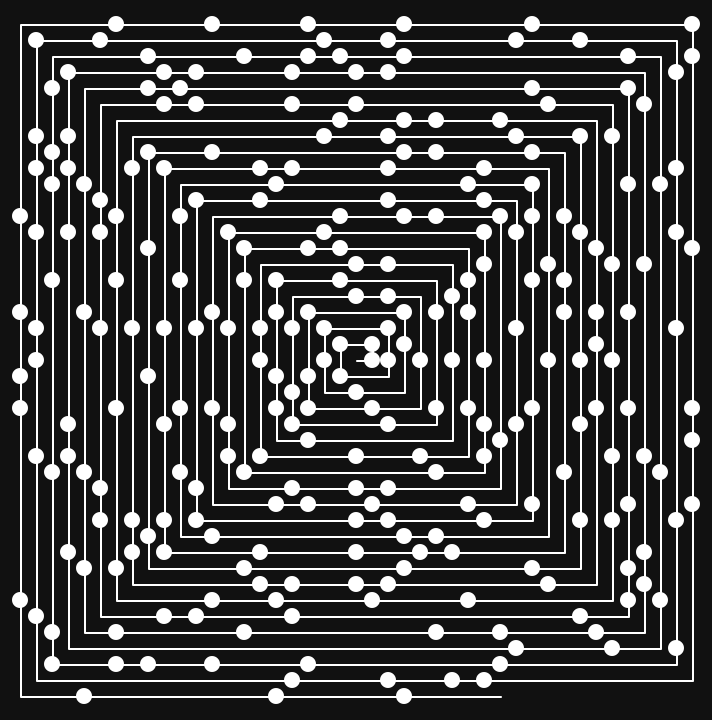

# Ulam (Prime) Spiral

The Ulam spiral or prime spiral is a graphical depiction of the set of prime numbers.

     
     

## Installation
`$ git clone https://github.com/dnellessen/ulam_spiral.git`\
or download ZIP.

## Usage
Pass in if you would like to use the <em>turtle</em> or the <em>pygame</em> module. Additional optional arguments are the size and whether the spiral line should be displayed.

Defualt: turtle, no line, size 5

`$ python3 /path/python/main.py turtle -l 10`\
`$ python3 /path/python/main.py pygame 3`

\
There is also a java implementation, which is much faster, but does not have an animation. Default arguments are a size of 2 and no line.\
The line argument cannot be alone; there has to be a boolean after the size argument.

`$ javad -d /path/java/bin/ /path/java/src/*.java`

`$ java -cp /path/java/bin/ UlamSpiral`\
`$ java -cp /path/java/bin/ UlamSpiral 10 true`
